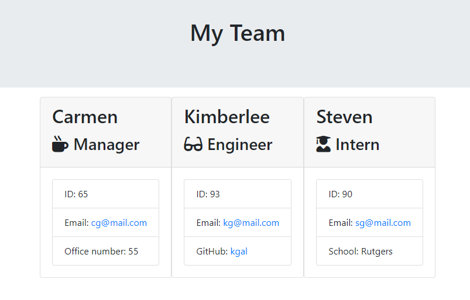

# Team Profile Generator

## Description 

In this project Node CLI was used to generate a team made up of Managers, Engineers, and Interns.   Test files are used to check if individual team objects are being correctly implimented along with the parent file Employee.js.  After information is input by the user a team.html file is rendered with the list of team members with names, id, email and other specific team member information.

## Table of Contents 

* [Installation](#installation)
* [Usage](#usage)
* [Credits](#credits)
* [License](#license)
* [Contributing](#contributing)
* [Tests](#tests)
* [Questions](#questions)

## Installation

The project can be cloned from my repository and run via code editor.  Using the integrated terminal a user can type node app.js to run the prompts to be filled in.  the output folder is where the team.html file will be created.

## Usage 

User will need to use the integrated terminal to run the app.js file using the line node app.js.  The user will be prompt questions about thier team and an team.html file will be generated in the output folder.  This app can be used to generate a team made up of managers, engineers, and interns.  The file will keep track of team member ID , emails, github, school, and room numbers.  This will allow managers to have quick access to their team member information.

## Screenshots/Video

## Contributing

Steven Galarza

## Tests

In order to run test you will need to use the integrated terminal and type npm run test.  This should run the Employee.test.js, Engineer.test.js, Intern.test.js, and the Manager.test.js files.

## Questions

You can find other projects that I have worked on at https://github.com/sgalarza419.
If there are any questions you may have please contact me at sgalarza4190@gmail.com.  

---
© 2020 Steven Galarza . All Rights Reserved.
